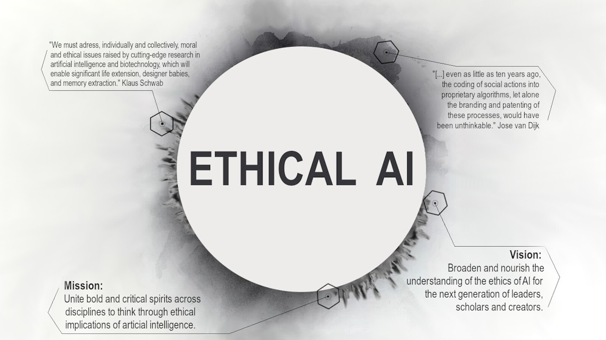

We are a group of students based at Concordia University, Montreal, Canada, who are interested in studying the field of **Artificial Intelligence (AI)** from a transdisciplinary perspective.

We want to explore what are the effects of AI on our **society** and how we can integrate **ethical** ways of thinking in AI-based practices, innovation and services.

- What should computer-scientists, policy-makers and the general public know and understand about AI?
- What is our **responsibility** towards AI, as creators, users, regulators, and as a society?
- What **challenges** does AI pose for democracy, creativity, liberty, justice and compassion?
- Shall we consider AI as **citizens** of our society and shall we treat them with the same set of **regulations** that we already have for humans?
- How does AI make us rethink the concepts of **consciousness** , **humanity** and **self-awareness**?
- What are the **opportunities** AI offer for humans? What are the **risks** involved in developing AI?

_We are going to read, discuss and learn from each other to_ **_solidify our thoughts_** _for each of the above questions._

## Our mission:

- Unite bold and critical spirits across disciplines to think through ethical implications of artificial intelligence
- Open possibilities for integrating ethical concerns into the curriculum of AI-related fields of study

## Our vision:

- Broaden and nourish the understanding of the ethics of AI for the next generation of leaders, scholars and creators

